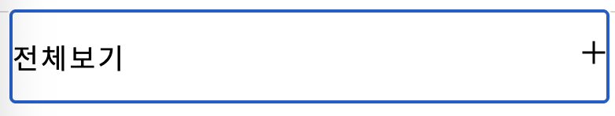

이번 주의 과제는 야무쌤께서 내 주신 과제 중 2번, 컴포넌트 클론 개발(개선 반영)을 선택하였습니다. 1번 과제인 캐러셀로 했다가는 주말 이틀을 다 쓰고서도 완성을 못할 수 있을 것 같다는 생각이 들기도 했지만(한편 미완의 제출도 학습이라는 취지에는 결국 부합한다고 믿습니다.), JS의 난이도에 다소 기가 죽어있던 제게는 매우 작더라도 보다 완결성 있게 과제를 마무리 하는 경험이 필요하다는 생각이 들었기 때문이기도 했습니다. 이에 수업시간에 동기분들의 코드리뷰도 진행해 주신 바 있는 아코디언 컴포넌트를 선택해 보기로 마음먹었습니다. 다시 말해 과제를 고르던 시점에는 - 조야한 표현에 사과드립니다 - 2번이 더 쉬워보였습니다.

그런데 과연 더 쉬운 선택이었는지 모르겠습니다. 현시점의 제게 선택지가 있는 JS과제의 난이도를 정확히 판단할 능력치가 있다고 꼭 믿지는 않았지만 과제를 수행할 컴포넌트를 **_그저 찾는데에만_** 4시간 이상이 소요되는 경험부터가 꽤 초조했기 때문입니다. 그런 면에서는 난이도에 대한 부분은 우선은 접어두더라도 시간상의 이점은 그닥 없었던 것 같습니다.
한편 '귀 사가 만든 아코디언 컴포넌트에는 분명 어딘가 문제가 있을거에요' 라는 마음으로, 교보e북 홈페이지 저자소개란의 **지나치게 잘 작동하는**(탭키도 잘 먹고, 커서 크기도 적절하고, 쓸데없이 화려한 애니메이션이 들어가지도 않은)컴포넌트의 문제점만을 뷰포트 크기를 키우고 줄여가며 1시간이 넘게 '헐뜯어보는'시간은 그 나름대로 재밌었지만 마치 성질 나쁜 트집쟁이가 된 듯한 기분이 들기도 했다는 점을 고백합니다.

초조함과 약간의 재미를 느끼다 방문한 룰루레몬 사이트에는 정말 감사하게도(?) 제가 '헐뜯을'구석이 있었습니다. 탭키를 눌러 커서를 가져다 대니 커서가 지나치게 컸던 것입니다. 발견한 시점에는 "오, 커서를 이렇게 크게 잡아주시면 키보드 사용자가 아코디언 컴포넌트를 활성화 시켜줄 +버튼이 동작하는지 여부가 헷갈리지 않을까요?"라고 기세좋게 중얼거렸던 것도 같습니다.

이번 과제는 따라서 룰루레몬 메뉴탭의 아코디언 컴포넌트의 클론코딩 및 개선하기 입니다. 개선하고 싶은 사항은 지나치게 크게 잡히는 커서를 +버튼을 적절히 감싸는 크기로 줄이는 것입니다.

사실 이번 회고에서 클론코딩이라는 표현을 적는것이 찔리는 점이 있습니다. 이 과제에서는 큰 틀에서 이해되는 범위까지만 룰루레몬을 참고하고 나머지는 제 마음대로 마크업과 css 및 JS를 작성해 과제를 제출하고 '수행하는 기능과 보이는 모습이 다소 비슷하니 이것은 클론코딩입니다' 라고 주장하고 있기 때문입니다. 당초 과제를 선정 할 때 '어떤 컴포넌트의 기능을 개선해보세요' 라는 대목에만 집중하고 클론코딩이라는 대목은 너무 얕본 탓이기도 합니다. 개발자 도구를 열어 단순해보였던 코드를 뜯어본 시점에서에서는 2번 과제가 1번 과제보다 쉬워보였다 라는 당초의 판단이 상당히 적절하지 않았었구나라는 확신이 들었습니다.
단순해 보이는 컴포넌트에서도 용도를 짐작하기 힘든 복잡한 이름의 클래스들이 매우 여러가지 사용되고 있었고, 따라서 a태그 하나에 제가 보기엔 이럴필요가 있나 싶을 정도의 코드가 들어가 있었던 것입니다. 단순하게 따라하는데만 해도 긴 시간이 걸릴 것이란 예상이 들었습니다. 그러므로 이를 하나하나 따져서 우선 최대한 똑같이 만들겠다는 생각은 밀어넣고, JS기능을 수업시간에 야무쌤께서 강조하셨던 여러 부분들을 잘 지키면서 동작하게 만드는데 집중하는 동시에 **이 서비스에서 어떤 점을 개선할 수 있는가**에 보다 집중하게 됐습니다.

이하는 제가 생각하는 제가 제출한 과제에서 룰루레몬 서비스 대비 개선점입니다.

1. 룰루레몬은 '전체보기'에 a태그를 사용했는데, 시맨틱 관점에서 좋지 않다고 판단해 button태그로 변경하였습니다. 원본 룰루레몬의 a태그에 있던 tabindex를 생략할 수 있기도 하고 무엇보다 원본 사이트에서 전체보기는 아코디언 컴포넌트를 활성화 하는데 쓰일 뿐 다른 사이트로 연결하는 역할 자체가 없습니다. 다시 말해 시맨틱 하지 않습니다.

2. 룰루레몬의 경우 '전체보기'와 +-(펼침 및 접기버튼) 전체가 커서로 잡히게 되는 문제가 있었는데 이를 css에서 기본 outline을 제거하고, + / - 아이콘v 에만 커스텀 outline을 적용하는 방법을 통해 해결했습니다.

3. 제가 교보e북의 쫀쫀한 아코디언 컴포넌트를 구경하다 감동을 한 부분이 있습니다. 컴포넌트를 활성화/비활성화 할 때 쓰이는 버튼에 펼치기 접기 등의 한국 말을 사용했다는 점입니다. 몇년 전 부터 이슈가 되고 있는 노년층의 기술소외문제, 좀 더 구체적으로는 키오스크가 불편하고 복잡하다던가, 혹은 버스의 하차벨에 stop이라고 엉뚱하게도 영어가 쓰여져 있다던가 하는 이슈는 상당히 유명할 것입니다. 저는 룰루레몬도 비록 외국기업이지만 +나 -같이 매우 직관적이고 널리 쓰이되 웹의 ui에 익숙하지 않은 누군가는(ex:노년층) 한번에 알아 볼 수 없는 기호보다는, 펼치기와 접기 같은 한글을 쓰거나, 최소한 장려해야 한다고 생각합니다. 따라서 컴포넌트의 문구를 + -에서 한글로 "펼치기"와 "감추기"로 바꾸어 보았습니다. 많은 분들에게(심지어 제게도) +-와 '펼치기'와 '감추기'는 무차별하게 느껴지겠지만, 누군가에게는 그 차이가 기술격차를 줄여주는 요긴한 도움이 될 수 있다고 생각합니다.

이하는 이번 과제에서 아쉬운 점 입니다.

야무쌤께서 진행하는 강의의 메인 주제는 어디까지나 JS강의인데, html과 CSS선에서 충분히 해결 가능한 개선점이 있는 컴포넌트로 과제를 수행한 점이 아쉽습니다. 둘째로 ai 의존도가 너무 높다는 생각입니다. 사소한것도 물어보고 진행하게 되니 속도가 더딘것은 둘째로 하고라도, 과제를 하는건지 ai와 대화를 하고 있는건지 헷갈릴 지경입니다. 사실 이건 이번 과제만의 이야기가 아니기도 합니다. 셋째로 커밋시점입니다. 어느정도 기능을 하게 된 다음에야 커밋을 하게 되는데, 결국 그러다보면 과제가 단순한만큼 사소한 수정이 남은 상태이거나 혹은 과제 자체가 거의 끝난시점에 커밋을 하게 됩니다. 그러나 분명 커밋을 더 잘게 쪼개거나, 합리화 할 수 있는 방법이 있다고 느낍니다.

읽어주셔서 감사합니다.
