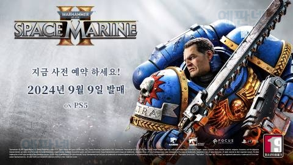
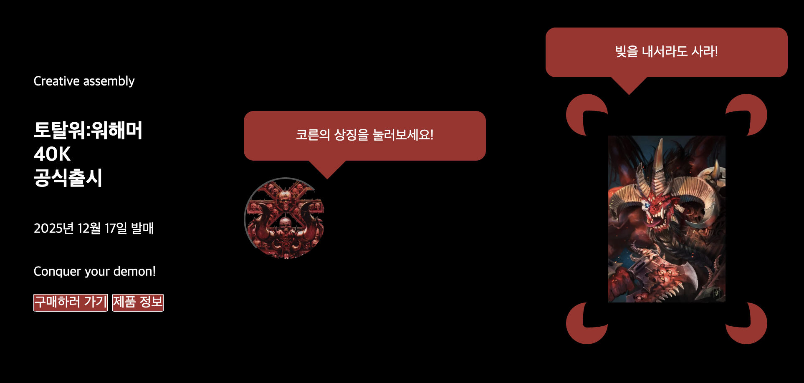

## 과제 선정

이번 주의 과제는 야무쌤께서 내주신 과제 중 2번 개인 디자인으로 하였습니다. 달리 펼치고 싶은 디자인이 있는것은 아니었지만, 기본 주어진 시안은 상당히 미려해 보였기 때문에 주말 가족여행과 멋사모임으로 시간이 목요일 저녁부터 금요일 오전까지 밖에 없는 일정상 JS까지는 가지도 못하고 css조차 완성할 자신이 없었기 때문입니다. 또한 주어진 시안의 디자인이 미려한 만큼, 미완으로 내면 더욱 모양새가 빠질듯하다는 판단도 들었습니다.

그렇다고 과제를 내지 않는다는 선택지는 떠올리기도 싫었습니다. 따라서 css요소를 대폭 간소화한 과제를 빠르게 완성해서 제출한다는 계획을 세우게 됐습니다. 야무쌤께서 제공해 주시는 고품질의 강의를 수강해 놓고 얄팍한 계획을 늘어놓기가 민망스럽습니다.

한편 목요일 저녁에는 이동을 해야해서 지하철에서 마크업과 css를 작업하였는데 생각외로 집중이 잘 돼 재밌는 경험이었습니다.

## 주제 선정

기다리던 게임 시리즈의 발표 소식은 언제나 참 설레고, 기다릴 게임은 많기 때문에 저는 연중 많은 날을 설레면서 지내는 편입니다. 참 감사한 일입니다. 또다시 감사하게도 보통 발매발표 페이지는 주로 텍스트와 간단한 이미지로 이루어져 있어 따라하기 좋겠다는 생각을 했습니다. 이처럼 단순한 스타일의 페이지에 몇가지 버튼과, css만으로 가능한 디자인에 애니메이션 요소를 넣는것이 제 목표입니다.

아울러 개인적으로는 **매우 기다리고 있지만 절대로 나오지 않을것 같은** 시리즈와 장르의 조합으로 가상의 발매페이지를 구성해 보기로 했습니다.

(여담이지만 꾸준한 루머가 있는 조합인만큼 개발사께서 용단을 내려 진행했으면 합니다. 게이머들의 지갑은 늘 열려 있으니까요.
)

## 마크업과 css에 대하여

버튼태그의 경우 이미지를 입혀 텍스트는 기능을 상실하였기에 대체텍스트의 느낌으로 sr리더기 사용자가 파악하기 좋은 문장을 구성해 보았습니다.. 또한 css의 기능만으로 보더라디우스와 일부분에만 색을 입히는 방식으로 불을 표현해 보았습니다.(해당 프렌차이즈의 악마들 중 일부는 인게임에서 뭔가 불과 관련된 이펙트가 많습니다.) 불의 경우 svg파일을 구해서 본때있게 표현할수도 있었겠지만 뭔가 css만으로 도형을 만들어 보고 싶었습니다. 만들고보니 불이라기보단 집게같지만 애니메이션으로 뱅글 돌려보니 불이라고 우길수도 있을것 같습니다. 또한 게임발매페이지라는 취지에 맞게 게이머들의 흥을 돋울수 있도록 해당 프렌차이즈의 인기캐릭터가 게임 구매를 독려하는 식의 멘트를 넣어봤습니다.

## 애니메이션에 대하여

코른의 악마라면 불을 그냥 위아래로도 움직이겠지만 빙글빙글 돌리기도 하지 않을까~? 라는 생각에서 불덩이를 돌리는 이미지를 형상화해봤습니다. 그저 불이라고 주장하는 집게모양의 붉은도형이 디자인이 전혀 들어가지 않은 캐릭터이미지 주위를 돌아갈 뿐이지만 상당히 뿌듯한 경험이었습니다. 또한 일률적으로 돌아가지 않도록 도형마다 듀레이션을 다르게 주었고, 말풍선에 대한 애니메이션은 캐릭터가 외친다는 느낌이 돌도록 위아래로 움직이게 했습니다. 애니메이션 저장/중지 버튼은 토글로 구성하였는데, 끊기는 느낌이 들지 않도록 pause를 이용하여 매번 중단된지점에서 다시 재생되게 하였습니다.
<video src="./animations/assets/images/화면 기록 2025-07-04 오후 10.02.03.mov" controls autoplay muted loop width="600"></video>

## 이번 주의 느낀점

처음에는 디자인적인 목표치가 낮기 때문에 금방 끝나겠거니 했는데 생각보다 긴 시간이 걸렸습니다. 더구나 긴 시간은 우선 차치하고라도 아무리 마크업이 단순한 페이지라도 디자인적인 완성도 있게 페이지를 구성하는 것은 별개의 문제로 전혀 단순한 일이 아니라고 느꼈습니다. css나 마크업의 문제도 있지만 기획의 영역이기 때문일 것으로 생각합니다. 부트캠프에 온 목적은 프론트엔드 전반의분야에 아주 익숙해지고 해당 분야의 전문가가 되기위함(최소한 지향하기 위함)일 것입니다. 이는 괴발개발 마크업과 css를 하고 매우 단순한 애니메이션을 넣는데 6-7시간이 걸리는 지금시점에서는 전문가라는 단어가 조금은 막연하게 느껴지는 시간이었습니다. 지치지 않고 가보겠습니다. 이번주도 읽어주셔서 감사합니다.
